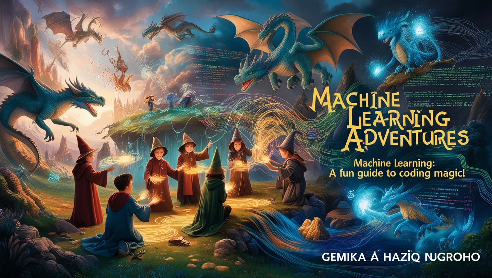

# The Gemika's Magical Guide to Sorting Hogwarts Students using the Decision Tree Algorithm 🌟🧙‍♂️✨

Ah, dear reader, let us step beyond the veil and enter the hallowed halls of Hogwarts School of Witchcraft and Wizardry! The castle looms majestically against the starlit sky, its turrets and towers whispering secrets of ancient magic. Here, within these enchanted walls, we delve not just into spells and potions but into the mysterious world of data science. And who better to guide you than I, Professor Gerry Leo Nugroho, esteemed friend of the legendary Albus Dumbledore, and proud father of young Gemika Haziq Nugroho, an 8-year-old prodigy with a heart full of curiosity and a wand full of potential. 🏰 ✨

As the sun rises over the Forbidden Forest, casting a golden glow upon the castle, students from all four houses—Gryffindor, Hufflepuff, Ravenclaw, and Slytherin—gather in the Great Hall. The enchanted ceiling mirrors the sky outside, and the long tables are filled with chatter and laughter. Amidst this magical atmosphere, we embark on a journey that blends the ancient art of divination with the modern science of data. Just as wizards and witches harness their wands, we shall wield Python and Jupyter Notebooks to unravel the secrets hidden within our enchanted dataset. 🌌✨

Imagine, if you will, the Sorting Hat perched upon a high stool, ready to decide the destiny of each new student. But what if we could use a different kind of magic to predict which house each student belongs to? With the Decision Tree Algorithm as our spellbook, we shall conjure models that reveal patterns and insights as if peering into a crystal ball. This adventure will require intellect as sharp as a Ravenclaw's, courage as bold as a Gryffindor's, loyalty as steadfast as a Hufflepuff's, and cunning as shrewd as a Slytherin's. 🧙‍♂️✨

As we walk the corridors of Hogwarts, we will uncover the mysteries of data exploration and visualization. We'll transform mundane numbers into dazzling charts, much like how Professor Flitwick's charms turn everyday objects into magical wonders. Young Gemika, ever inquisitive, will pop up with quizzes to challenge your understanding and ensure that every step of the journey is both enlightening and entertaining. His questions will prompt you to think deeply, much like how Dumbledore's musings often led Harry Potter to profound realizations. 🪄✨

So, gather your wands (or, in this case, your Python installations) and prepare for a journey that bridges the world of Muggles and magic. Whether you're a seasoned data scientist or a young witch or wizard eager to learn, this guide will enchant you with its blend of fantasy and knowledge. Together, we shall unravel the secrets of the Sorting Hat using the powerful spells of data science. Welcome to Hogwarts, and may your quest for knowledge be as boundless as the night sky above our beloved castle. 🌌✨

Let the adventure begin! 🧙‍♂️🚀

---

### 1. **Welcome to Hogwarts School of Witchcraft and Wizardry! 🏰**

- Introduction to Professor Gerry Leo Nugroho
- Meet Gemika Haziq Nugroho, an eager young wizard

### 2. **Preparing Your Wand: Setting Up Your Magical Tools 🪄**

- Installing Python for Windows, macOS, and Linux
- Installing Necessary Libraries with Pip
- Installing Jupyter Notebook
- Gemika's Pop-Up Quiz: Preparing Your Wand

### 3. **Exploring the Enchanted Dataset 🌟**

- Introduction to the Dataset
- Loading Libraries in Python
- Reading the Dataset into a Pandas DataFrame
- Gemika's Pop-Up Quiz: Exploring the Enchanted Dataset

### 4. **Unveiling the Mysteries: Data Exploration (EDA) 🔍**

- Inspecting the First Few Rows
- Checking for Missing Values
- Summarizing the Data
- Pivoting Data for Hidden Patterns
- Statistical Analysis with Pandas
- Gemika's Pop-Up Quiz: Unveiling the Mysteries

### 5. **Visualizing the Wizarding World with Enchanted Charts 📊**

- Plotting the Distribution of Hogwarts Houses
- Visualizing Relationships between Features
- Interactive Charts for an Engaging Experience
- Discovering Patterns with Pair Plots
- Gemika's Pop-Up Quiz: Spotting the Trends

### 6. **Casting One-Hot Encoding Spells ✨**

- Understanding Categorical Data
- Transforming Categorical Data using One-Hot Encoding
- Gemika's Pop-Up Quiz: Decoding the Spells

### 7. **Conjuring New Features from Magic 🪄**

- Creating New Features from Existing Ones
- Engineering Features to Improve the Model
- Gemika's Pop-Up Quiz: Crafting the Perfect Spell

### 8. **Splitting the Potion: Data Splitting ⚗️**

- Dividing the Data into Training and Testing Sets
- Ensuring a Balanced Split
- Gemika's Pop-Up Quiz: Balancing the Potion

### 9. **Summoning the Decision Tree Algorithm 🌳**

- Introduction to Decision Trees
- Training the Decision Tree Classifier
- Gemika's Pop-Up Quiz: Understanding the Tree's Magic

### 10. **Peering into the Crystal Ball: Data Prediction 🔮**

- Making Predictions with the Trained Model
- Evaluating the Model's Performance
- Gemika's Pop-Up Quiz: Predicting the Future

### 11. **Measuring Magical Accuracy 📏**

- Calculating Accuracy, Precision, and Recall
- Confusion Matrix: The Mirror of Erised for Data
- Gemika's Pop-Up Quiz: Evaluating the Results

### 12. **Tuning the Magic: Hyperparameter Tuning 🎛️**

- Understanding Hyperparameters
- Using GridSearchCV to Find the Best Parameters
- Gemika's Pop-Up Quiz: Fine-Tuning the Magic

### 13. **Protecting Against Dark Magic: Avoiding Overfitting 🧙‍♂️**

- Identifying Overfitting and Underfitting
- Pruning the Decision Tree
- Gemika's Pop-Up Quiz: Defending Against Dark Arts

### 14. **Interpreting the Decision Tree: The Marauder's Map 🗺️**

- Visualizing the Decision Tree
- Understanding Decision Paths
- Gemika's Pop-Up Quiz: Mapping the Decisions

### 15. **Deploying Your Magical Model 🚀**

- Saving the Trained Model with Pickle
- Loading and Using the Model for Future Predictions
- Gemika's Pop-Up Quiz: Deploying the Spell

### 16. **Sharing the Magic with Fellow Wizards 📚**

- Creating a Magical Report
- Sharing Insights with the Hogwarts Community
- Gemika's Pop-Up Quiz: Presenting the Findings

### 17. **Continuing Your Journey: Advanced Topics in Magic 🧙‍♀️**

- Introduction to Random Forests
- Exploring Other Machine Learning Algorithms
- Gemika's Pop-Up Quiz: Diving Deeper into Magic

### 18. **The Chamber of Secrets: Troubleshooting and Debugging 🐍**

- Common Errors and Their Solutions
- Debugging Tips and Tricks
- Gemika's Pop-Up Quiz: Solving Mysteries

### 19. **Enchanting Your Code: Best Practices in Python 🐍**

- Writing Clean and Readable Code
- Using Comments and Documentation
- Gemika's Pop-Up Quiz: Perfecting Your Spells

### 20. **Farewell from Professor Nugroho and Gemika Haziq 🎩**

- Wrapping Up the Magical Journey
- Encouragement to Explore Further

### 21. **Extra Spells and Potions: Appendices and Resources 📜**

- Additional Resources for Learning
- Glossary of Terms
- Gemika's Final Pop-Up Quiz: Testing Your Knowledge

---
